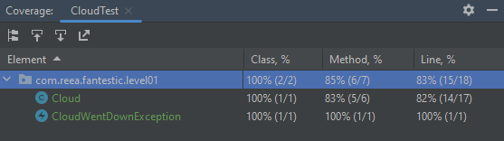

# FanTESTic

This application is meant for learning how to test Java applications. 

## Level 1 - Assertions
The first level is meant to teach you about basic assertions using the libraries AssertJ and JUnit5. 
 
### Unit Testing
* meant to test ONE AND ONLY ONE thing 
* we mainly use ASSERTIONS 
* we can use libraries such as JUnit 4/5, AssertJ
* if we have multiple possible paths in a method, we have to write a test for each of them
  * having an _if statement_ in the code -> two (2) possibilities -> two (2) different tests
  * be careful of branching 
  * covering as many of these branches as possible increases the code coverage
  * never test multiple paths in a single unit test, remember that a unit test is testing JUST ONE THING

### Code Coverage 
* how much of the code we tested, as a percentage
* can be _class_ coverage, _method_ coverage or _line_ coverage
* IntelliJ is very helpful
* you can run tests with coverage:   
* it shows you exactly how much the tests you ran touched:  

* you can also see the exact lines that were covered by the tests (red = not touched, green = touched):  

### Assertions
* you can have many of them in a single test (never test two flows in a single test though)
* most popular assertions are testing these:
  * the truth value
  * if an object is null/not null
  * equality 
* most popular libraries: JUnit 4/5 and AssertJ
* AssertJ is more flexible

### For YOU to do
* the following exercises are meant to familiarize you with assertions and the meaning of a unit test
* go to the class [CloudTest](src/test/java/com/reea/fantestic/level01/CloudTest.java)
and follow the instructions written above the class declaration

### Recommended Reading 
* JUnit assertions: https://www.baeldung.com/junit-assertions
* AssertJ: https://www.baeldung.com/introduction-to-assertj

## Level 2 - Mocking

### Mocks
* a mock is something that pretends to be something real
* it does what you want it to do, not what the class should actually be doing

### For YOU to do
* the following exercises are meant to familiarize you with mocking in unit tests
* go to the class [SkyServiceTest](src/test/java/com/reea/fantestic/level02/service/SkyServiceTest.java)
  and follow the instructions written above the class declaration

### Recommended Reading
* baledung: https://www.baeldung.com/mockito-series
* mocking methods that return void: https://www.baeldung.com/mockito-void-methods

## Level 3 - MockMvc

### Using MockMvc
* used for calling endpoints from the inside
* you have to set everything you would usually set in Postman:
  * the url with path variables (only what comes after the domain and port, MockMvc knows what to put in front of it)
  * headers
  * body
  * authorization
* you have different kinds of assertions, with which you can check a bunch of stuff:
  * the HTTP response codes
  * the response body
    * usually as json
    * for objects, you need an object mapper (serializing the object to compare with)
  * part of the response body
    * check for a specific field in the body
    * you can even check elements in a list
  * if it throws and exception

### Integration Testing
* you test more than one unit (remember that a unit test is testing a single thing)
  * e.g. controller + service + repository
* you test how different classes work together, how they INTEGRATE
* you do not need to mock as many things as in the case of unit testing, 
sometimes you do not have to mock anything
* for example, when doing integration testing with MockMvc, you no longer need to mock the services (let it flow)

### For YOU to do
* the following exercises are meant to familiarize you with MockMvc
* go to the class [SkyControllerTest](src/test/java/com/reea/fantestic/level03/controller/SkyControllerTest.java)
  and follow the instructions written above the class declaration
* for integration testing go to [SkyIntegrationTest](src/test/java/com/reea/fantestic/level03/integration/SkyIntegrationTest.java)
  and follow the instructions written above the class declaration

### Recommended reading
* MockMvc basics: https://www.baeldung.com/spring-boot-testing
